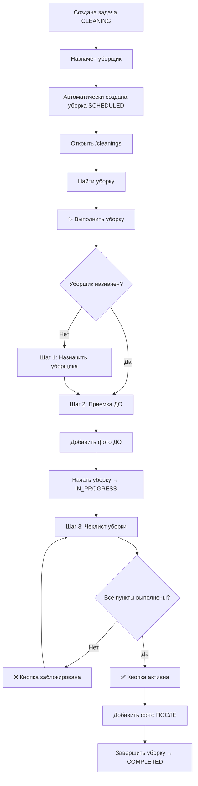

# 🧹 Обновление: Выполнение уборок только через страницу /cleanings

## Что изменилось

### 1. Убрана возможность выполнения уборки со страницы /tasks
- ❌ Удалена кнопка "✨ Выполнить уборку" из меню задач
- ✅ Теперь выполнение уборки доступно **только** на странице `/cleanings`

### 2. Добавлена обязательная валидация всех чекбоксов
- ✅ Все пункты чеклиста **обязательны** к выполнению
- ✅ Невозможно завершить уборку, пока не отмечены все пункты
- ✅ Кнопка "Завершить уборку" заблокирована до выполнения всех пунктов

### 3. Улучшен UI прогресса выполнения
- ✅ Добавлен **прогресс-бар** с процентами выполнения
- ✅ Счетчик "N из M" показывает, сколько пунктов выполнено
- ✅ Визуальная индикация: выполненные пункты подсвечиваются зеленым
- ✅ Выполненные пункты зачеркиваются
- ✅ Каждый выполненный пункт отмечается галочкой ✓

## Как использовать

### Шаг 1: Перейдите на страницу уборок
```
/cleanings → Вкладка "Уборки"
```

### Шаг 2: Найдите уборку
Уборки со статусом:
- 🟠 **SCHEDULED** (Запланирована) 
- 🔵 **IN_PROGRESS** (В процессе)

### Шаг 3: Откройте меню действий
Нажмите на `⋮` (три точки) в строке уборки

### Шаг 4: Выберите "✨ Выполнить уборку"
Откроется диалог с тремя этапами:

#### Этап 1: Назначение уборщика (если еще не назначен)
- Выбор уборщика
- Указание, требуется ли смена белья
- Добавление заметок

#### Этап 2: Приемка квартиры (до уборки)
- Чеклист приемки:
  - ☐ Проверить состояние мебели
  - ☐ Проверить бытовую технику
  - ☐ Проверить сантехнику
  - ☐ Сфотографировать текущее состояние
- Добавление фотографий ДО уборки

#### Этап 3: Выполнение уборки ⭐
**Прогресс-бар:**
```
Прогресс: 3 из 8                              37%
████████░░░░░░░░░░░░░░░░░░░░
```

**Чеклист (все обязательны):**
- ☑ Пропылесосить все комнаты ✓
- ☑ Помыть полы ✓
- ☑ Протереть пыль ✓
- ☐ Убрать в ванной
- ☐ Убрать на кухне
- ☐ Сменить постельное белье
- ☐ Проверить все приборы
- ☐ Вынести мусор

**Фотографии ПОСЛЕ уборки:**
- Добавление фотографий результата

**Кнопка завершения:**
- 🔴 Неактивна: `Завершить уборку (3/8)` - если не все выполнено
- 🟢 Активна: `✓ Завершить уборку` - если все пункты отмечены

## Валидация при завершении

Если попытаться завершить уборку с незаполненным чеклистом:

```
⚠️ Невозможно завершить уборку!

Не отмечены следующие пункты:
• Убрать в ванной
• Убрать на кухне
• Сменить постельное белье
• Проверить все приборы
• Вынести мусор

Пожалуйста, выполните все пункты чеклиста.
```

## Визуальные изменения

### Прогресс-бар
- **0-99%:** Синий цвет
- **100%:** Зеленый цвет

### Чек-боксы
- **Не выполнено:** Белый фон, обычный текст
- **Выполнено:** Зеленый фон, зачеркнутый текст, галочка ✓

### Кнопка завершения
- **Неактивна (не все выполнено):**
  - Серый цвет
  - `cursor-not-allowed`
  - Показывает прогресс: "Завершить уборку (3/8)"
  
- **Активна (все выполнено):**
  - Зеленый цвет
  - `✓ Завершить уборку`

## Измененные файлы

### Frontend
1. **`frontend/backoffice/src/app/(app)/tasks/page.tsx`**
   - Убраны кнопки "Выполнить уборку"
   - Убран импорт и использование CleaningExecutionDialog

2. **`frontend/backoffice/src/app/(app)/cleanings/page.tsx`**
   - Добавлена кнопка "✨ Выполнить уборку" в меню действий
   - Добавлен импорт CleaningExecutionDialog
   - Добавлено состояние для диалога выполнения

3. **`frontend/backoffice/src/components/cleaning-execution-dialog.tsx`**
   - Добавлен прогресс-бар с процентами
   - Добавлена валидация всех чекбоксов
   - Улучшен UI: зеленые фоны, зачеркивание, галочки
   - Кнопка завершения блокируется до выполнения всех пунктов

## Workflow выполнения уборки



## Преимущества

✅ **Централизация** - все выполнение уборок в одном месте
✅ **Контроль качества** - невозможно "пропустить" пункты
✅ **Прозрачность** - видно точный прогресс выполнения
✅ **Удобство** - визуальная обратная связь на каждом шаге
✅ **Документирование** - фото ДО и ПОСЛЕ обязательны

## Связанная документация

- `AUTO_CLEANING_CREATION_FEATURE.md` - автоматическое создание уборок
- `CLEANING_TASKS_ASSIGNMENT_UPDATE.md` - назначение уборщиков
- Компонент: `frontend/backoffice/src/components/cleaning-execution-dialog.tsx`
- Страница уборок: `frontend/backoffice/src/app/(app)/cleanings/page.tsx`

## Тестирование

1. Создайте задачу CLEANING
2. Назначьте уборщика (уборка создастся автоматически)
3. Перейдите на `/cleanings`
4. Найдите созданную уборку (статус "Запланирована")
5. Нажмите `⋮` → "✨ Выполнить уборку"
6. Пройдите все этапы:
   - Приемка (если нужно)
   - Отметьте все чекбоксы один за одним
   - Наблюдайте прогресс-бар
   - Убедитесь, что кнопка активируется только при 100%
   - Завершите уборку

## Возможные улучшения

- [ ] Сохранение прогресса при закрытии диалога
- [ ] Автосохранение чеклиста каждые 30 секунд
- [ ] Возможность добавлять фото прямо с камеры
- [ ] Голосовые заметки к пунктам чеклиста
- [ ] Push-уведомления уборщику
- [ ] Таймер на выполнение каждого пункта
- [ ] История изменений чеклиста

